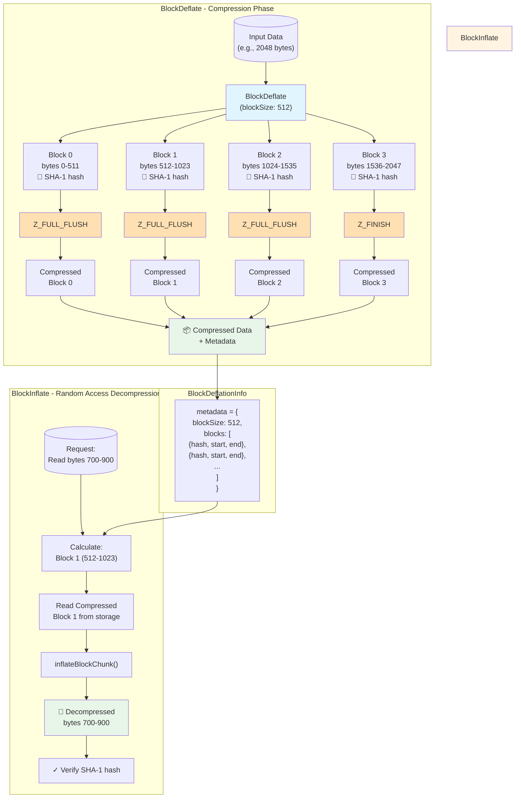

# @talepack/zlib-random-access

A TypeScript library for random access reading and writing of zlib-compressed data. This library extends [pako](https://github.com/nodeca/pako) to enable efficient compression and decompression of data in blocks, allowing you to read specific portions of compressed data without decompressing the entire stream.

## Features

- **Random Access Decompression**: Read specific byte ranges from zlib-compressed data without full decompression
- **Block-Based Compression**: Compress data in independent blocks using Z_FULL_FLUSH
- **Hash Verification**: SHA-1 hashes for data integrity verification of blocks
- **Metadata Tracking**: Automatic tracking of block boundaries, offsets, and sizes
- **TypeScript Support**: Fully typed TypeScript API
- **Efficient Storage**: Optimized for scenarios requiring frequent partial reads

## Installation

```bash
npm install @talepack/zlib-random-access
```

## Quick Start

### Block-Based Compression

```typescript
import { BlockDeflate } from '@talepack/zlib-random-access';

// Create a block-based compressor with 512-byte blocks
const deflate = new BlockDeflate({ level: 6, blockSize: 512 });

// Compress your data
const inputData = new TextEncoder().encode('Your data here...');
deflate.push(inputData, true);

// Get the compressed data and metadata
const compressed = deflate.result;
const metadata = deflate.deflationInfo;

console.log(`Compressed size: ${compressed.length}`);
console.log(`Number of blocks: ${metadata.blocks.length}`);
```

### Random Access Reading

```typescript
import { BlockInflate } from '@talepack/zlib-random-access';

// Read a specific byte range (bytes 512-1024) from compressed data
const reader = {
  readSync: (buffer: Uint8Array, start: number, length: number) => {
    // Your implementation to read from storage
    const data = yourDataStore.slice(start, start + length);
    buffer.set(data);
    return data.length;
  }
};

const result = BlockInflate.readBlockRangeSync(
  reader,
  512,  // start position
  512,  // length to read
  { deflationInfo: metadata },
  0     // offset
);

console.log(new TextDecoder().decode(result));
```

## How Block-Based Compression Works

The library enables random access by compressing data in independent blocks. Here's a visual overview of the process:



### Key Concepts

- **Z_FULL_FLUSH**: Creates independent compressed blocks that can be decompressed without previous blocks
- **Block Tracking**: Each block's compressed position is stored in metadata
- **Hash Verification**: SHA-1 hashes ensure data integrity at the block level
- **Selective Reading**: Only requested blocks are decompressed, not the entire stream

### Example Flow

1. **Compression**: 2048 bytes of input → 4 blocks (512 bytes each) → 4 independent compressed blocks
2. **Storage**: Store compressed data + metadata (block offsets, hashes)
3. **Random Access Read**: Want bytes 700-900? → Only decompress Block 1 (covers bytes 512-1023)
4. **Result**: Get bytes 700-900 without decompressing Blocks 0, 2, or 3

## Core Classes

### BlockDeflate

Compresses data in blocks with automatic hash generation and metadata tracking.

#### Constructor

```typescript
new BlockDeflate(options: pako.DeflateOptions & { blockSize: number })
```

- `blockSize`: Size of each uncompressed block in bytes
- Other options passed to pako.Deflate

#### Methods

- **push(data, mode)**: Add data to compress. Automatically handles block boundaries and Z_FULL_FLUSH
- **deflationInfo**: Metadata about the compressed structure (block offsets, hashes, etc.)
- **result**: Final compressed data (Uint8Array)

#### Example

```typescript
const deflate = new BlockDeflate({ level: 6, blockSize: 1024 });

// Push data - blocks are automatically created
deflate.push(chunk1);
deflate.push(chunk2, true);  // true = finalize

const compressed = deflate.result;
const info = deflate.deflationInfo;
```

### BlockInflate

Decompresses individual blocks or ranges from block-compressed data.

#### Static Methods

- **inflateBlockChunk(blockChunk, options)**: Inflate a single compressed block
- **getBlockChunk(data, blockIndex, options, offset)**: Extract a compressed block from data
- **readBlockRangeSync(reader, start, length, options, offset)**: Read a byte range across multiple blocks
- **readDeflatedBlockSync(reader, blockIndex, options, offset)**: Read a raw compressed block

#### Example

```typescript
// Inflate a single block
const blockData = BlockInflate.getBlockChunk(compressed, 0, { deflationInfo });
const decompressed = BlockInflate.inflateBlockChunk(blockData, { deflationInfo });

// Read a range spanning multiple blocks
const range = BlockInflate.readBlockRangeSync(
  reader,
  1500,  // start
  1000,  // length
  { deflationInfo },
  0
);
```

### SeekInflate

Advanced class for seeking and reading specific ranges within a zlib stream. Provides streaming decompression with position tracking.

#### Constructor

```typescript
new SeekInflate(options: {
  inputChunkSize: number;
  reader: (buffer: Uint8Array, start: number, end: number) => number;
  onChunkDeflated?: (buffer: Uint8Array, position: number) => void;
  inflatedHasher?: Hash;
})
```

#### Methods

- **inflateRange(buffer, inflatedPosition, inflatedLength, flush_mode)**: Inflate a specific range
- **fillNextWindowBuffer(flush_mode)**: Internal method to fill the next window

#### Example

```typescript
const inflate = new SeekInflate({
  inputChunkSize: 4096,
  reader: (buffer, start, end) => {
    const data = fetchDataFromStorage(start, end - start);
    buffer.set(data);
    return data.length;
  }
});

const output = new Uint8Array(1000);
const bytesRead = inflate.inflateRange(output, 5000, 1000);
```

### ChunkBlockDeflate

Simpler chunk-based compression that doesn't enforce block sizes but still tracks chunk boundaries.

#### Constructor

```typescript
new ChunkBlockDeflate(options?: pako.DeflateOptions)
```

#### Methods

- **pushChunk(data, contentHash, last?)**: Push a chunk with its hash
- **deflationInfo**: Metadata about chunk structure

#### Example

```typescript
const deflate = new ChunkBlockDeflate();

deflate.pushChunk(chunk1, 'hash1');
deflate.pushChunk(chunk2, 'hash2', true);

const compressed = deflate.result;
```

## Data Structures

### BlockDeflationInfo

```typescript
type BlockDeflationInfo = {
  blockSize: number;          // Size of each uncompressed block
  header: Uint8Array;         // zlib header (2 bytes)
  hash: string;               // Combined hash of all blocks
  blocks: {
    hash: string;             // SHA-1 hash of the block
    start: number;            // Start offset in compressed data
    end: number;              // End offset in compressed data
  }[]
}
```

## Use Cases

- **File Archives**: Access individual files from compressed archives without full extraction
- **Database Backups**: Restore specific records from compressed backups
- **Log Files**: Read specific time ranges from compressed logs
- **Large Datasets**: Access subsets of large compressed datasets
- **Streaming Applications**: Serve partial content from compressed sources

## How It Works

The library uses `Z_FULL_FLUSH` during compression to create independent zlib blocks. Each block can be decompressed independently without requiring data from previous blocks. The library tracks:

1. **Block Boundaries**: Start and end positions of each compressed block
2. **Hashes**: SHA-1 hashes for integrity verification
3. **Metadata**: Header information and overall structure

This allows you to:
- Compress once, read many times at different positions
- Verify data integrity at the block level
- Avoid full decompression when you only need a portion of the data

## Performance Considerations

- **Block Size**: Smaller blocks = more overhead but more granular access
- **Compression Level**: Higher levels = better compression but slower
- **Memory Usage**: Controlled by `inputChunkSize` in SeekInflate
- **Hash Computation**: SHA-1 adds minor overhead during compression

## Dependencies

- [pako](https://github.com/nodeca/pako) - zlib port to JavaScript
- [@oslojs/crypto](https://github.com/paranoiache/oslo) - SHA-1 hashing

## License

Apache-2.0

## Contributing

Contributions are welcome! Please ensure tests pass:

```bash
npm test
```

And that the code follows the project's linting rules:

```bash
npm run lint
```
